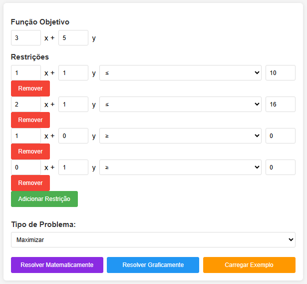
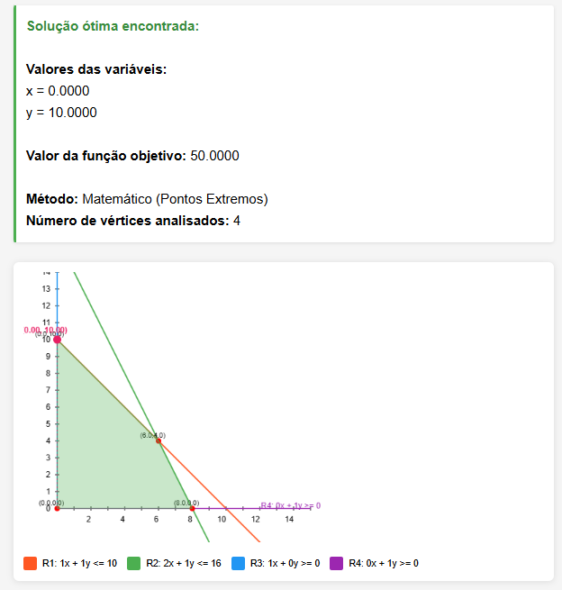

# README - Programa de Programação Linear (Métodos Matemático e Gráfico)

## 📌 Visão Geral

Este projeto implementa uma ferramenta interativa para resolver problemas de Programação Linear utilizando tanto o método matemático (analítico) quanto o método gráfico.

## ✨ Funcionalidades Principais

- **Interface intuitiva** para inserção do problema
- **Solução matemática** pelo método dos vértices
- **Visualização gráfica** completa com:
  - Eixos coordenados com escala
  - Representação das restrições
  - Região viável destacada
  - Vértices marcados e identificados
  - Solução ótima destacada

## 📊 Exemplo de Saída

## 🛠️ Tecnologias Utilizadas

- HTML5
- CSS3
- JavaScript puro (Vanilla JS)
- Canvas API para renderização gráfica

## 🚀 Como Usar

1. Insira os coeficientes da função objetivo
2. Adicione as restrições do problema
3. Selecione se deseja Maximizar ou Minimizar
4. Clique em:
   - **"Resolver Matematicamente"** para a solução analítica
   - **"Resolver Graficamente"** para a visualização

## 📦 Exemplo Pronto

O sistema já vem com um exemplo pré-configurado (mostrado na primeira imagem):
Maximizar: 3x + 5y
Sujeito a:
1x + 1y ≤ 10
2x + 1y ≤ 16
x ≥ 0
y ≥ 0